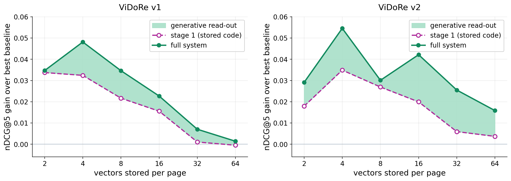

# GLIE: Generative Late-Interaction Embeddings for Visual Document Retrieval
**Authors:** [Mohamed Eltahir](https://www.linkedin.com/in/mohammad2012191), [Talal Aloushan](https://www.linkedin.com/in/talal-aloushan-5355b8270), [Rose Khairoalsendi](https://www.linkedin.com/in/rose-khairoalsendi-05864b365/), [Jana Shatta](https://www.linkedin.com/in/jana-shata), [Mohammed Alhassan](https://www.linkedin.com/in/mohammed-alhassan10), [Leen Alrehaili](https://www.linkedin.com/in/leen-s-alrehaili-451937340/), [Tanveer Hussain](https://www.linkedin.com/in/tinu445) and [Naeemullah Khan](https://www.linkedin.com/in/profkhan/).

<div align="center">

[](https://arxiv.org/abs/2609.11808)

</div>


<div align="center">
  
  <p><em>Margin over the strongest training-free baseline at each budget on <b>(left)</b> ViDoRe v1 and <b>(right)</b> ViDoRe v2, shared y-limits. The dashed line is the stored code alone and the shaded band is what the generative read-out adds. On v1 the margin concentrates at aggressive budgets and the band closes as the code saturates. On v2, which saturates nowhere, both persist to k=64.</em></p>
</div>


---

## Highlights
- **Geometry first**: A page's ~1,000 token vectors lie exactly on the unit sphere and concentrate near a manifold of intrinsic dimension **five to six**, the same on every corpus and encoder we measure. The method follows from that measurement.
- **Spherical anchoring, free**: Standard $k$-means centroids fall inside the sphere and systematically underestimate MaxSim. Projecting them back to the surface costs nothing and is worth up to **+0.093 nDCG@5**. Any dot-product late-interaction system can adopt it today.
- **Store few, regenerate many**: GLIE stores $k \ll N$ learned vectors per page as a standalone index, and a shared decoder regenerates the full set on demand for a top-$L$ shortlist, which is rescored exactly.
- **Frozen encoder, one fit**: 415K parameters, under three GPU-minutes per budget, fitted once on the public ColPali training collection and applied **zero-shot** to every evaluation corpus. No re-encoding, no adapter weights, no per-corpus labels.
- **Beats every prior post-hoc baseline on 10/10 ViDoRe v1 subsets and 4/4 ViDoRe v2 subsets at every budget**, and beats encoder fine-tuning at a matched training budget by +0.074 to +0.132.
---


## News
- [2026-09] Preprint released.
---


## Methodology
<div align="center">
  
  <p><em><b>Training.</b> The encoder stays frozen. Per-page k-means centroids are normalized to the sphere (spherical anchoring), a small refiner adjusts them while reading the full token set, and a shared decoder regenerates the page from the refined code. Five kinds of loss train the code and the regenerated vectors to preserve retrieval scores, rankings, and page geometry. Reconstruction error is deliberately absent.</em></p>
</div>

<div align="center">
  
  <p><em><b>Inference.</b> Every page is scored on its k stored vectors, then only the top-L shortlist is decoded back to full length and rescored exactly with MaxSim. Cheap over everything, expensive over almost nothing.</em></p>
</div>

---


# Guide for GLIE

## 🧩 Prerequisites
- Python **3.10+**
- CUDA-compatible GPU (one **A100** fits every budget in about sixteen GPU-minutes; a V100 works, slower)
- `conda` or `pip` package manager
- About **0.5 MB of disk per cached page** for ColPali embeddings (the ten ViDoRe v1 subsets are ~3.5 GB)

---

## ⚙️ Installation


```bash
# Clone the repository
git clone https://github.com/mohammad2012191/GLIE.git
cd GLIE

# Install torch for your CUDA version, then the rest
pip install torch --index-url https://download.pytorch.org/whl/cu121
pip install -r requirements.txt
```

ColPali v1.3 works with recent `transformers`. ColQwen2 v1.0 loads its adapter correctly only with `transformers<=4.49`, so use a separate environment for that sweep if your default is newer.

---
## Required Data

1. **ViDoRe v1** (ten subsets): pulled from the Hugging Face Hub at runtime under `vidore/*_test` and `vidore/*_test_subsampled`. No manual download.
2. **ViDoRe v2** (four subsets, graded multi-relevant qrels): pulled at runtime under `vidore/*_v2`.
3. **ColPali training collection** (`vidore/colpali_train_set`, `train` split): the only data the codec is fitted on. Pulled at runtime; capped by `--train_on_max_pages`.
4. **Encoders** (`vidore/colpali-v1.3`, optionally `vidore/colqwen2-v1.0`): downloaded to `$HF_HOME` on first use.

Page embeddings are cached under `--cache_dir` after the first extraction, so every later run of the same corpus skips the encoder entirely.

---

## GLIE Usage Guide

### Main table (ViDoRe v1, every method, every budget)

Fits the codec on 5,000 pages of the ColPali training collection and evaluates it zero-shot on all queries of all ten subsets. This is the paper's standard protocol.

```bash
python -m glie.run_main \
  --datasets vidore/arxivqa_test_subsampled vidore/docvqa_test_subsampled \
             vidore/infovqa_test_subsampled vidore/tabfquad_test_subsampled \
             vidore/tatdqa_test vidore/shiftproject_test \
             vidore/syntheticDocQA_artificial_intelligence_test vidore/syntheticDocQA_energy_test \
             vidore/syntheticDocQA_government_reports_test vidore/syntheticDocQA_healthcare_industry_test \
  --train_on vidore/colpali_train_set --train_on_split train --train_on_max_pages 5000 \
  --eval_all_queries --refiner zero_init --codes 2 4 8 16 32 64 --seed 0 --tag main
```

Or, for all three seeds and the pooled table in one go:

```bash
bash scripts/reproduce_main.sh
```

Outputs land in `out/results/main__main_table.csv` (every `(dataset, k, method)` cell), `out/results/main__results.json` (plus training history), and `out/checkpoints/colpali_train_set__train_k{k}_main.pt`. Rows per `(dataset, k)`:

| row | meaning |
|---|---|
| `ceiling` | the uncompressed encoder, all $N$ vectors |
| `raw_kmeans` | per-page $k$-means centroids as stored |
| `norm_kmeans` | the same centroids projected to the sphere: GLIE's training-free stage |
| `token_pool` | sequential token pooling |
| `cluster_merge` | Light-ColPali's semantic merge, without its fine-tuning |
| `glie_stage1` | the learned code alone, single-stage retrieval |
| `glie_decoder` | the full system: stage 1 plus the generative rerank of the top-$L$ |
| `glie_oracle` | the same shortlist rescored with the true vectors, an upper bound on the decoder |

Storage is reported in bytes per page and includes GLIE's two per-cluster scalars, so every comparison is storage-matched.

### ViDoRe v2 (zero-shot with the same checkpoints)

```bash
python -m glie.vidore_v2 \
  --cache_dir ./cache_v2 --ckpt_dir ./out/checkpoints --ckpt_tag main \
  --out_dir ./out/results --codes 2 4 8 16 32 64 --tag v2
```

v2 ships BEIR-style with graded, multi-relevant qrels. The script reuses the checkpoints from the main run and adds only a graded-nDCG scoring layer. Run with `--inspect` first on a newer dataset release; column names have shifted between versions.

### Second encoder (ColQwen2)

```bash
python -m glie.run_main --model_name vidore/colqwen2-v1.0 --cache_dir ./cache_colqwen2 \
  --datasets <the ten subsets above> \
  --train_on vidore/colpali_train_set --train_on_split train --train_on_max_pages 5000 \
  --eval_all_queries --refiner zero_init --codes 2 4 8 16 32 64 --tag colqwen2
```

### Light-ColPali at a matched training budget

```bash
# 1. sanity check: the untrained merge must reproduce stock ColPali + merging
python -m glie.train_lightcolpali --datasets <the ten subsets> --eval_all_queries \
  --codes 2 4 8 16 32 64 --eval_at_init --tag lcp_init

# 2. the fine-tune: 4,000 query-page pairs, five epochs, one LoRA per budget
python -m glie.train_lightcolpali --datasets <the ten subsets> --eval_all_queries \
  --codes 2 4 8 16 32 64 --max_train_pairs 4000 --epochs 5 --batch 8 --grad_accum 4 --lr 5e-5 --tag lcp
```

### Geometry

```bash
python -m glie.geometry_study   --cache_dir ./cache --out ./out/results/geometry.json
python -m glie.geometry_control --cache_dir ./cache --out ./out/results/geometry_control.json
```

The first reports TwoNN intrinsic dimension, participation ratio, and the $k$-means inertia exponent per page. The second re-runs TwoNN on a Gaussian fitted to each page's own covariance and on uniform noise of the same size.

## Configuration Parameters

### Required for the standard protocol

| Parameter | Description | Example |
|-----------|-------------|---------|
| `--datasets` | Evaluation corpora (Hugging Face ids) | `vidore/arxivqa_test_subsampled ...` |
| `--train_on` | Fitting source; the codec never sees `--datasets` | `vidore/colpali_train_set` |
| `--train_on_split` | Split of the fitting source | `train` |
| `--train_on_max_pages` | Page cap on the fitting source | `5000` |
| `--eval_all_queries` | Score every query of every subset, as the official evaluator does | flag |
| `--codes` | Budgets $k$ to sweep | `2 4 8 16 32 64` |
| `--tag` | Names the output files and checkpoints | `main` |

### Model and training

| Parameter | Description | Default | Options |
|-----------|-------------|---------|---------|
| `--model_name` | Encoder | `vidore/colpali-v1.3` | `vidore/colqwen2-v1.0` |
| `--refiner` | Stage-1 code refiner | - | `zero_init` (paper), `none` (anchoring only) |
| `--decoder` | Generative read-out | `anchored` | `none` (stage 1 only) |
| `--topl` | Shortlist size rescored by the decoder | `20` | evaluation-only with `--reuse` |
| `--lr`, `--epochs`, `--patience` | AdamW rate, max epochs, early-stop patience | `2e-4`, `100`, `5` | |
| `--seed` | Training seed | `0` | paper reports `0 1 2` |
| `--reuse` / `--no_reuse` | Skip a `(source, k, tag)` whose checkpoint exists | on | |


## 📝 Citation

If you use GLIE in your research, please cite:


```bibtex
@misc{eltahir2026generativelateinteractionembeddingsvisual,
      title={Generative Late-Interaction Embeddings For Visual Document Retrieval}, 
      author={Mohamed Eltahir and Talal Aloushan and Rose Khairoalsendi and Jana Shata and Mohammed Alhassan and Leen Alrehaili and Tanveer Hussain and Naeemullah Khan},
      year={2026},
      eprint={2609.11808},
      archivePrefix={arXiv},
      primaryClass={cs.IR},
      url={https://arxiv.org/abs/2609.11808}, 
}
```
