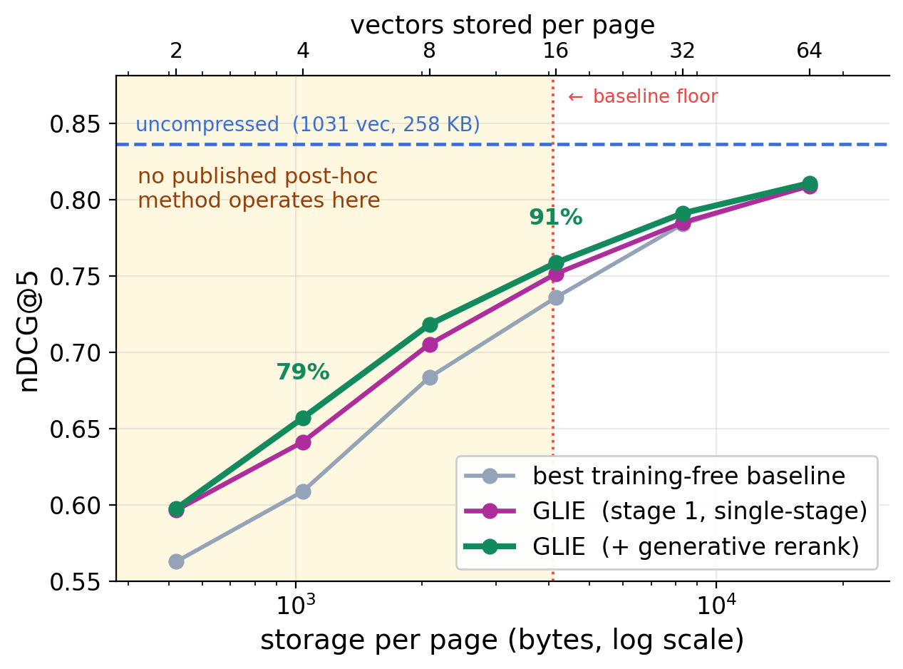

# GLIE: Generative Late-Interaction Embeddings
### Storing Token Manifolds, Not Token Sets

**Authors:** TBD — fill final author list.

<div align="center">

[](https://arxiv.org/abs/TBD)
[](LICENSE)
[](https://www.python.org/)

</div>

<div align="center">
  
  <p><em>(a) Retrieval quality against storage per page (log scale). GLIE retains 80% of uncompressed nDCG@5 at 258× compression (4 vectors, 1.0 KB per page) and 91% at 64×. The shaded region marks budgets below the most aggressive published post-hoc operating point (≈16 vectors per page). (b) The margin over the strongest training-free baseline concentrates below the covering demand predicted by the analysis: +0.069 mean nDCG@5 at k ≤ 8 against +0.020 above, a 3.5× step located between k=8 and k=16.</em></p>
</div>

---

## Highlights

- **Generative late-interaction embeddings.** A page is stored as `k` vectors and *regenerated* back to full length on demand, rather than pooled, pruned, or quantized. The stored code describes the token manifold instead of sampling it, which is what lets the budget fall below the regime where sampling-based codes collapse.
- **A covering bound that predicts where compression breaks.** Page token embeddings concentrate near a low-dimensional manifold on the unit sphere (measured intrinsic dimension ≈ 6). A lemma bounds the MaxSim error of any code by its covering radius, predicting that sampling-based codes are near-optimal *above* the manifold's covering demand and collapse *below* it — at roughly 16 vectors per page. Every experiment tests this prediction, which was made before the runs.
- **Retrieve-then-regenerate cascade.** Stage 1 scores the whole corpus on `k` vectors at pooled single-vector cost. Only the top-`L` shortlist is expanded back to 1,031 vectors and rescored by exact MaxSim. Cheap over everything, expensive over almost nothing.
- **Two structural guarantees, not tuned heuristics.** The refiner's output projection is zero-initialized, so the code *begins exactly at* normalized k-means and training can only improve on it. The decoder emits each cluster's refined vector verbatim at slot 0, so the decoded set *contains* the code set — and because MaxSim is a maximum, regeneration can add evidence but structurally cannot destroy it.
- **Post hoc and cheap.** The encoder is frozen; everything runs on cached embeddings. Fitting all ten corpora × six budgets takes **56 GPU-minutes** total with **415K trainable parameters**, against roughly 72 GPU-hours per budget for a fine-tuned competitor that GLIE outperforms at five of six budgets under matched training source.
- **Zero-shot transfer.** The codec conditions on nothing corpus-specific, so a code fitted on one collection applies unchanged to another — no target queries, no target fitting.

---

## News

- `[TBD]` arXiv preprint released.

---

## Methodology

<div align="center">
  
  <p><em>Training (top) and inference (bottom). At indexing, a page's 1,031 patch embeddings are clustered, projected onto the unit sphere, and refined into k stored vectors. At query time, every page is scored on those k vectors; only the top-L shortlist is decoded back to full length and rescored exactly.</em></p>
</div>

The method has three components, each of which provably starts at, and can only improve on, the strongest training-free solution:

| Stage | What happens | Cost |
|---|---|---|
| 0 | Frozen ColPali → 1,031 unit patch vectors; per-page k-means → centroids `c_j`, counts `n_j` | offline |
| 1 | **Spherical anchoring:** project centroids to the sphere, `u_j = c_j/‖c_j‖` | free |
| 2 | **Zero-init refinement:** cross-attention correction reading the full token set, initialized at zero | offline |
| 3 | **Store** `k` vectors | `1.0` KB/page at `k=4`, vs `257.8` KB |
| 4 | **Retrieve:** MaxSim over the `k` stored vectors, all pages | = pooling |
| 5 | **Regenerate & rerank:** decoder expands the code back to 1,031 vectors for the top-`L` | top-`L` only |

The training objective is *operator-matched*: the code and the regenerated vectors are trained to reproduce the frozen encoder's per-query-token MaxSim values, plus a listwise KL, a one-sided penalty on negatives that overshoot the teacher, a within-cluster Chamfer term, and a support-function matching term. **Reconstruction error is deliberately absent** — it optimizes a quantity we found anti-correlated with retrieval.

---

## Results

**ViDoRe v1 (10 subsets), macro-averaged held-out nDCG@5 by stored vectors per page.** All methods post hoc on frozen ColPali v1.3. Uncompressed ceiling = 0.848.

| Method | k=2 | k=4 | k=8 | k=16 | k=32 | k=64 |
|---|---|---|---|---|---|---|
| Raw k-means | 0.451 | 0.494 | 0.565 | 0.653 | 0.746 | 0.796 |
| Token pooling | 0.547 | 0.571 | 0.613 | 0.646 | 0.695 | 0.755 |
| Cluster merging | 0.462 | 0.473 | 0.539 | 0.611 | 0.685 | 0.775 |
| Normalized k-means | 0.523 | 0.597 | 0.653 | 0.737 | 0.803 | 0.827 |
| **GLIE** (stage 1) | 0.578 | 0.641 | 0.693 | 0.755 | 0.815 | 0.834 |
| **GLIE** (+ generative rerank) | **0.611** | **0.681** | **0.731** | **0.774** | **0.819** | **0.835** |
| *% of uncompressed* | *72%* | *80%* | *86%* | *91%* | *97%* | *98%* |
| Margin over best baseline | +.058 | +.077 | +.073 | +.035 | +.016 | +.008 |

Margins are against the **strongest** training-free baseline chosen *per subset and per budget* — token pooling wins several subsets at `k ≤ 8` and cluster merging wins others at `k ≥ 16`, so any single fixed baseline would overstate the gain.

<div align="center">
  
  <p><em>The margin forms a plateau of ≈0.07 across k ≤ 8, halves at k = 16, and decays to noise by k = 64 — the transition predicted at k ≈ 16 by the covering analysis before these runs. The same step appears independently in the single-stage read-out, replicates under a second refiner architecture, and reappears sharpest under zero-shot transfer.</em></p>
</div>

---

# Guide for GLIE

## 🧩 Prerequisites

- Python **3.10+**
- CUDA-compatible GPU (**A100** or better recommended; the codec itself is small, but extracting ColPali embeddings is the memory-heavy step)
- `conda` or `pip` package manager

---

## ⚙️ Installation

```bash
# Clone the repository
git clone https://github.com/TBD/GLIE.git
cd GLIE

# Install dependencies
pip install -r requirements.txt
```

---

## Required Data to Reproduce

**ViDoRe v1** — all ten subsets are pulled automatically from the HuggingFace Hub on first run and cached to `--cache_dir`. No manual download is needed; the first run is slow because it encodes every page with ColPali, and every run after that reads the cache.

| Subset | HF id |
|---|---|
| ArxivQA | `vidore/arxivqa_test_subsampled` |
| DocVQA | `vidore/docvqa_test_subsampled` |
| InfoVQA | `vidore/infovqa_test_subsampled` |
| TabFQuAD | `vidore/tabfquad_test_subsampled` |
| TAT-DQA | `vidore/tatdqa_test` |
| Shift Project | `vidore/shiftproject_test` |
| Synthetic (AI / Energy / Gov / Health) | `vidore/syntheticDocQA_*_test` |

For the matched-source transfer comparison you additionally need `vidore/colpali_train_set`, which is the training source Light-ColPali uses.

> **Note on corpus construction.** The corpus of each subset is its set of **unique pages**: rows are de-duplicated by image identity. Two subsets repeat pages across many queries, and indexing rows instead of pages understates even the uncompressed ceiling (0.29 instead of 0.73 on TAT-DQA). This is handled in `data.py` and you should not change it.

---

## GLIE Usage Guide

> **Run from the parent of `glie/`, not from inside it.** `glie` is a package, so `python -m glie.run_main` needs the directory *containing* `glie/` on the path.

### Sanity check (one dataset, one budget, few epochs)

```bash
python -m glie.run_main \
  --datasets vidore/arxivqa_test_subsampled \
  --codes 8 --epochs 6 --min_epochs 2 \
  --refiner zero_init --decoder anchored \
  --cache_dir ./cache --out_dir ./out \
  --tag smoke
```

### Main table (full ViDoRe v1, all budgets)

```bash
python -m glie.run_main \
  --datasets vidore/arxivqa_test_subsampled vidore/docvqa_test_subsampled \
             vidore/infovqa_test_subsampled vidore/tabfquad_test_subsampled \
             vidore/tatdqa_test vidore/shiftproject_test \
             vidore/syntheticDocQA_artificial_intelligence_test \
             vidore/syntheticDocQA_energy_test \
             vidore/syntheticDocQA_government_reports_test \
             vidore/syntheticDocQA_healthcare_industry_test \
  --codes 2 4 8 16 32 64 \
  --refiner zero_init --decoder anchored \
  --cache_dir ./cache --out_dir ./out \
  --tag vidore_full
```

Writes `out/results/vidore_full__main_table.csv`, `__pivot.csv`, and `__results.json`, and prints the margin over the best training-free baseline per budget.

### Zero-shot transfer

Fit the codec **once** on the source corpora, then apply it frozen to unseen targets — no target queries, no target fitting:

```bash
python -m glie.run_main \
  --train_on vidore/docvqa_test_subsampled vidore/infovqa_test_subsampled \
  --datasets vidore/arxivqa_test_subsampled \
  --codes 2 4 8 16 32 64 \
  --refiner zero_init \
  --cache_dir ./cache --out_dir ./out \
  --tag transfer_loo_arxiv
```

Pass **several** source corpora to test whether transfer improves with source *diversity*; batches are interleaved across them, and model selection uses only the source holdouts, never the target.

### Light-ColPali baseline

Always measure the floor first. LoRA initializes to zero, so the floor is stock ColPali + merge — **a fine-tuned score below the floor means the optimizer is damaging the backbone; lower the learning rate, do not train longer.**

```bash
python -m glie.train_lightcolpali --codes 4 8 16 --eval_at_init --tag lcp_floor
```

```bash
python -m glie.train_lightcolpali \
  --codes 4 8 16 32 64 --max_train_pairs 4000 \
  --lr 5e-5 --loss pairwise \
  --tag lcp_matched
```

### Ablations

Every ablation is a flag, never a code edit.

```bash
# refiner architecture
python -m glie.run_main --codes 2 4 16 --refiner zero_init     --tag abl_refiner_zero
python -m glie.run_main --codes 2 4 16 --refiner gated_tangent --tag abl_refiner_gated
python -m glie.run_main --codes 2 4 16 --refiner none          --tag abl_refiner_none  # = normalized k-means

# decoder on/off
python -m glie.run_main --codes 2 4 16 --decoder none --tag abl_nodecoder

# leave-one-out over the loss terms
python -m glie.run_main --codes 4 16 --w_cluster_set 0   --tag abl_no_clusterset
python -m glie.run_main --codes 4 16 --w_support 0       --tag abl_no_support
python -m glie.run_main --codes 4 16 --w_overshoot 0     --tag abl_no_overshoot
python -m glie.run_main --codes 4 16 --w_gen_listwise 0  --tag abl_no_genlistwise

# seeds for error bars
for s in 0 1 2; do python -m glie.run_main --codes 2 4 8 --seed $s --tag seed$s; done
```

### Figures

```bash
python -m glie.plots --results out/results/vidore_full__results.json --out_dir Figures/
```

---

## Configuration Parameters

### Core Arguments

| Parameter | Description | Default |
|---|---|---|
| `--datasets` | Corpora to evaluate on | 3 dev subsets |
| `--codes` | Stored-vector budgets `k` to sweep | `2 4 8 16 32 64` |
| `--model_name` | Frozen encoder (HuggingFace id) | `vidore/colpali-v1.3` |
| `--cache_dir` | Embedding + k-means cache | *(required)* |
| `--out_dir` | Checkpoints and results | *(required)* |
| `--tag` | Names the results file | `main` |

### Method

| Parameter | Description | Default | Options |
|---|---|---|---|
| `--refiner` | Refiner architecture | `gated_tangent` | `zero_init` (**paper**), `gated_tangent`, `none` |
| `--decoder` | Generative read-out | `anchored` | `anchored`, `none` |
| `--topl` | Shortlist size rescored by the decoder | `20` | int |
| `--decoder_alpha_max` | Max tangent displacement of a child from its anchor | `0.75` | float |
| `--heads` | Refiner attention heads | `4` | int |
| `--dec_hidden` | Decoder hidden width | `256` | int |

### Split and Training

| Parameter | Description | Default |
|---|---|---|
| `--split_seed` | Query split seed — **shared by every method** | `0` |
| `--holdout_frac` | Held-out query fraction | `0.2` |
| `--train_frac` | Fraction of fit queries actually used (data-scaling ablation) | `1.0` |
| `--epochs` / `--min_epochs` | Training length | `100` / `30` |
| `--lr` | Learning rate | `2e-4` |
| `--hard_negatives` | Hard negatives per query, mined once under the frozen code | `7` |
| `--seed` | Model init / training seed | `0` |

### Transfer

| Parameter | Description |
|---|---|
| `--train_on` | Fit the codec **once** on these corpora, apply frozen to `--datasets` |
| `--train_on_split` | HF split for the source corpora (`test`, or `train` for `colpali_train_set`) |
| `--train_on_max_pages` | Page cap for source corpora only |

### Loss Weights

Each weight is an ablation switch — set to `0` to drop the term.

| Parameter | Term | Default |
|---|---|---|
| `--w_gen_token` | Per-token MaxSim MSE on regenerated vectors | `1.00` |
| `--w_gen_listwise` | Listwise KL on regenerated vectors | `1.00` |
| `--w_code_token` / `--w_code_listwise` | Same two terms on the stored code | `0.50` / `0.50` |
| `--w_overshoot` | One-sided penalty on overscored negatives | `0.50` |
| `--w_cluster_set` | Within-cluster Chamfer | `0.50` |
| `--w_support` | Support-function matching on fixed random directions | `0.10` |

---

## Repository Layout

```
config.py               every setting; the split, metric, and budgets live here
data.py                 extraction, caching, make_split, per-page k-means + slot layout
metrics.py              THE eval harness + storage accounting
models.py               refiners (zero_init | gated_tangent | none) + anchored decoder
losses.py               each term behind its own weight (ablation = a flag, not an edit)
baselines.py            raw/normalized k-means, cluster-merge, token pooling
train_glie.py           GLIE training with leak-free hard-negative mining
train_lightcolpali.py   Light-ColPali baseline (LoRA + merge), same harness
run_main.py             driver: every method x every budget x every dataset -> main table
plots.py                figure generation
```

**The one invariant:** every method is scored by `metrics.evaluate_static` / `metrics.evaluate_cascade` and nothing else, on the split returned by `data.make_split`. If two methods are ever scored by different code or on different splits, the main table is worthless. That is why scoring and splitting each live in exactly one function.

---

## 📝 Citation

If you use GLIE in your research, please cite:

```bibtex
@misc{TBD,
      title={Generative Late-Interaction Embeddings: Storing Token Manifolds, Not Token Sets},
      author={TBD},
      year={2026},
      eprint={TBD},
      archivePrefix={arXiv},
      primaryClass={cs.IR},
      url={https://arxiv.org/abs/TBD},
}
```

## Acknowledgements

Built on [ColPali](https://github.com/illuin-tech/colpali) and the [ViDoRe benchmark](https://huggingface.co/vidore). Baselines reproduce [Light-ColPali](https://arxiv.org/abs/2506.04997) and [token pooling](https://arxiv.org/abs/2409.14683).
